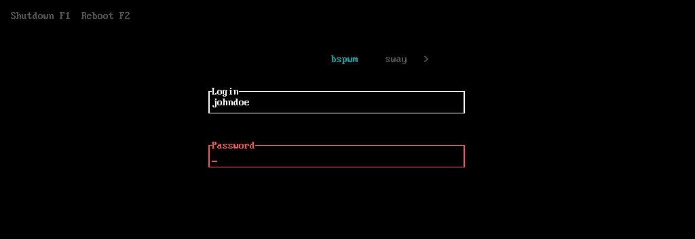

	
# Lemurs 🐒
A TUI Display/Login Manager written in Rust
	

**WIP: Whilst the project is working and installable, there are still a lot of
bugs and limitations.**

A minimal lightweight TUI [Display Manager/Login
Manager](https://wiki.archlinux.org/title/Display_manager) written in Rust
similar to [Ly](https://github.com/nullgemm/ly).

## Goal

The goal of this project is to create a small, robust and yet customizable 
Login Manager which can serve as the front-end to your graphical GNU/Linux
or BSD environment. Lemurs uses Linux PAM as its method of authentication.

## Installation

*The project is not yet ready to be installed*
